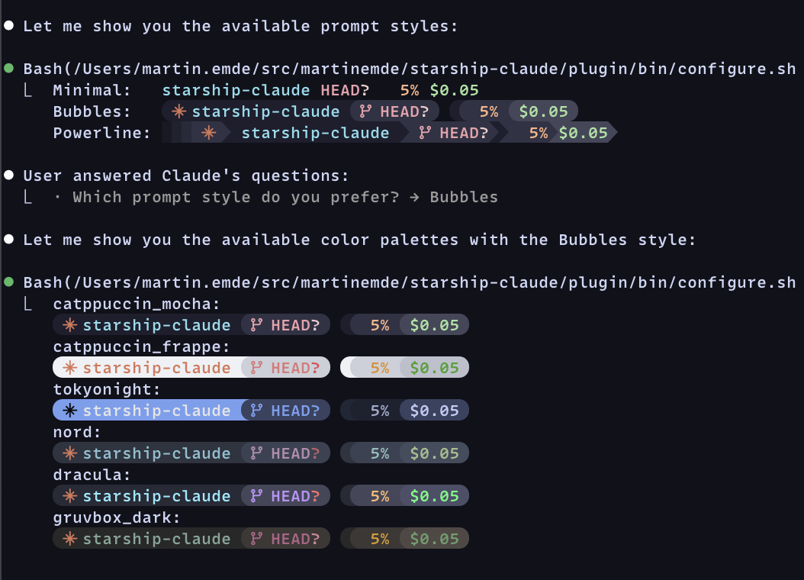

# starship-claude

[](https://github.com/martinemde/starship-claude/actions/workflows/ci.yml)



_Use [Starship](https://starship.rs) for your [`claude` code](https://claude.ai/products/claude-code) status line._

## Quick Start

> [!TIP]
> Run each of the following commands in `claude` _one at a time_.

```claude
/plugin marketplace add martinemde/starship-claude
```

```claude
/plugin install starship-claude@starship-claude
```

Then run the setup wizard:

```claude
/starship-claude:setup
```

The wizard is just instructions to claude that will help with setup:

1. Check if starship is installed (offers to install if missing)
2. Detect existing configuration and ask what to do
3. Ask about Nerd Font support
4. Let you choose a color palette
5. Let you choose a prompt style
6. Install the script and generate your config
7. Update your Claude Code settings
8. Verify everything works

## Manual Install

You need [starship installed](https://starship.rs/#quick-install). (that's why you're here right?)
We ❤️ [Nerd Fonts](https://www.nerdfonts.com/) for the shapes and the robots. I recommend getting one.

```bash
# If you don't already have starship...
curl -sS https://starship.rs/install.sh | sh
```

Then run these commands in your shell.

```bash
# get the script
mkdir -p ~/.local/bin
curl -fsSL https://raw.githubusercontent.com/martinemde/starship-claude/main/starship-claude \
  -o ~/.local/bin/starship-claude && chmod +x ~/.local/bin/starship-claude

# get the config file
mkdir -p ~/.claude
curl -fsSL https://raw.githubusercontent.com/martinemde/starship-claude/main/starship.toml \
  -o ~/.claude/starship.toml
```

Add the statusline in your Claude Code settings (`~/.claude/settings.json`):

```jsonc
{
  // ... other stuff
  "statusLine": {
    "type": "command",
    "command": "~/.local/bin/starship-claude",
  },
}
```

Run it directly to test it out but you'll need to grab a [test fixture JSON file](https://raw.githubusercontent.com/martinemde/starship-claude/refs/heads/main/test/fixtures/low_cost_session.json).

```sh
./starship-claude < test/fixtures/low_cost_session.json
```

## My Favorite Feature: Context Window Progress Bar

Show progress bars for context usage percentages in terminals like Ghostty. (I love it!)

We use [Dex Horthy's "dumb zone" (video)][dumb-zone] to start warning at 40%.

- Progress bar scales for 80% compaction.
  - 0-40%: Normal - You're good.
  - 40-60%: Warning - Reset if it's not going well.
  - 60%+: Error - Compacting soon...

Warning does not mean stop, but be aware of your context usage.

> [!NOTE]
> This doesn't work in tmux even if you are using a Ghostty.
> Let me know if you find a workaround.

[dumb-zone]: https://www.youtube.com/watch?v=rmvDxxNubIg "YouTube: No Vibes Allowed: Solving Hard Problems in Complex Codebases – Dex Horthy, HumanLayer"

### Customize

Add these options to the `~/.claude/settings.json` if you want do things differently.

```sh
# custom config file
starship-claude --config ~/.config/starship/claude.toml

# disable terminal context progress bar (maybe it's printing weird characters?)
starship-claude --no-progress
```

## Starship Configuration

The `starship.toml` in this repo is standard starship with `env_var` configs. The parts I added from claude's data are visible below. Customize it like you would starship, or grab a preset and then add the custom bits for claude like you see here.

```toml
"$schema" = "https://starship.rs/config-schema.json"

# Don't add extra newline before prompt
add_newline = false

# Prompt format: directory | jj status | model | context | cost | duration
# Each section is separated by powerline-style arrows with background colors
format = """
$(env.CLAUDE_STAR)\
$directory\
$git_branch\
$git_status\
${env_var.CLAUDE_MODEL}\
${env_var.CLAUDE_CONTEXT}\
${env_var.CLAUDE_COST}\
"""

# Use Catppuccin Mocha color palette
palette = 'catppuccin_mocha'

# Catppuccin Mocha color definitions
# Full palette: https://github.com/catppuccin/catppuccin
[palettes.catppuccin_mocha]
rosewater = "#f5e0dc"
flamingo = "#f2cdcd"
pink = "#f5c2e7"
mauve = "#cba6f7"
red = "#f38ba8"
maroon = "#eba0ac"
peach = "#fab387"
yellow = "#f9e2af"
green = "#a6e3a1"
teal = "#94e2d5"
sky = "#89dceb"
sapphire = "#74c7ec"
blue = "#89b4fa"
lavender = "#b4befe"
text = "#cdd6f4"
subtext1 = "#bac2de"
subtext0 = "#a6adc8"
overlay2 = "#9399b2"
overlay1 = "#7f849c"
overlay0 = "#6c7086"
surface2 = "#585b70"
surface1 = "#45475a"
surface0 = "#313244"
base = "#1e1e2e"
mantle = "#181825"
crust = "#11111b"

[env_var.CLAUDE_STAR]
variable = "CLAUDE_STAR"
format = "[$env_value]($style)"
style = "fg:#D97757"

[directory]
style = "fg:sky"
format = "[ $path ]($style)"
truncation_length = 1      # Show only current directory
truncation_symbol = "…/"

[git_branch]
symbol = ""
style = "fg:maroon"
format = "[$symbol $branch ]($style)"

[git_status]
style = "fg:maroon"
format = "[($all_status$ahead_behind) ]($style)"

# Claude model display (haiku / sonnet / opus)
# Set by starship-claude script
[env_var.CLAUDE_MODEL]
variable = "CLAUDE_MODEL"
format = "[$env_value ]($style)"
style = "fg:sapphire"

# Context window usage percentage
# Set by starship-claude script
[env_var.CLAUDE_CONTEXT]
variable = "CLAUDE_CONTEXT"
format = "[$env_value ]($style)"
style = "fg:peach"

# Session cost
# Set by starship-claude script
[env_var.CLAUDE_COST]
variable = "CLAUDE_COST"
format = "[$env_value ]($style)"
style = "fg:green"
```

### Running Tests

Install BATS and run tests:

```bash
# Install BATS via mise
mise use bats@latest
mise install

# Run all tests
mise exec -- bats test/

# Run specific test file
mise exec -- bats test/model_extraction.bats
```

## License

MIT License © 2026 Martin Emde
