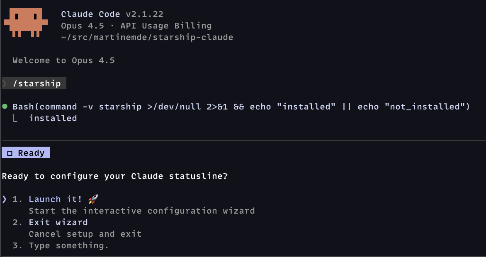

# starship-claude

[](https://github.com/martinemde/starship-claude/actions/workflows/ci.yml)


_Use [Starship](https://starship.rs) for your [`claude` code](https://claude.ai/products/claude-code) status line._

## Quick Start

> [!TIP]
> Run each of the following commands in `claude` _one at a time_.

```claude
/plugin marketplace add martinemde/starship-claude
```

```claude
/plugin install starship-claude@starship-claude
```

Then run the setup wizard:

```claude
/starship
```



The wizard is just instructions to claude that will help with setup:

1. Check if starship is installed (offers to install if missing)
2. Detect existing configuration and ask what to do
3. Ask about Nerd Font support
4. Let you choose a color palette
5. Let you choose a prompt style
6. Install the script and generate your config
7. Update your Claude Code settings
8. Verify everything works

## Manual Install

You'll need [starship](https://starship.rs/#quick-install) to render the statusline:

```bash
# If you don't already have starship...
curl -sS https://starship.rs/install.sh | sh

```

You'll probably want a [Nerd Font](https://www.nerdfonts.com/) (optional) for the robot icons.

When you're ready to install, run these in your terminal (not in claude):

```bash
# Download the script from this repository
mkdir -p ~/.local/bin
curl -fsSL https://raw.githubusercontent.com/martinemde/starship-claude/main/plugin/bin/starship-claude \
  -o ~/.local/bin/starship-claude && chmod +x ~/.local/bin/starship-claude

# Get the config file that you can customize
mkdir -p ~/.claude
curl -fsSL https://raw.githubusercontent.com/martinemde/starship-claude/main/plugin/templates/minimal-nerd.toml \
  -o ~/.claude/starship.toml
```

Add the statusline in your Claude Code settings (`~/.claude/settings.json`):

```jsonc
{
  // ... other stuff
  "statusLine": {
    "type": "command",
    "command": "~/.local/bin/starship-claude",
  },
}
```

Run it directly to test it out but you'll need to grab a [test fixture JSON file](https://raw.githubusercontent.com/martinemde/starship-claude/refs/heads/main/test/fixtures/low_cost_session.json).

```sh
./starship-claude < test/fixtures/low_cost_session.json
```

## My Favorite Feature: Context Window Progress Bar

Show progress bars for context usage percentages in terminals like Ghostty. (I love it!)

We use [Dex Horthy's "dumb zone" (video)][dumb-zone] to start warning at 40%.

- Progress bar scales for 80% compaction.
  - 0-40%: Normal - You're good.
  - 40-60%: Warning - Reset if it's not going well.
  - 60%+: Error - Compacting soon...

Warning does not mean stop, but be aware of your context usage.

> [!NOTE]
> This doesn't work in tmux even if you are using Ghostty.
> Let me know if you find a workaround.

[dumb-zone]: https://www.youtube.com/watch?v=rmvDxxNubIg 'YouTube: No Vibes Allowed: Solving Hard Problems in Complex Codebases – Dex Horthy, HumanLayer'

### Customize

Add these options to the `~/.claude/settings.json` if you want do things differently.

```sh
# custom config file
starship-claude --config ~/.config/starship/claude.toml

# disable terminal context progress bar (maybe it's printing weird characters?)
starship-claude --no-progress
```

### Running Tests

Install BATS and run tests:

```bash
# Install BATS via mise
mise use bats@latest
mise install

# Run all tests
mise exec -- bats test/

# Run specific test file
mise exec -- bats test/model_extraction.bats
```

## License

MIT License © 2026 Martin Emde
